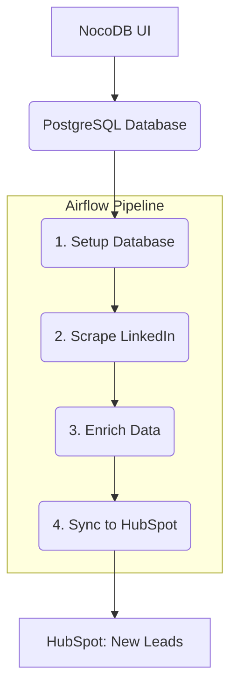

# LinkedIn Lead Generation Pipeline (Airflow)

## Overview
This project orchestrates a LinkedIn lead generation pipeline using [Apache Airflow](https://airflow.apache.org/) and the [Astronomer CLI](https://docs.astronomer.io/astro/cli/overview). The pipeline automates the process of scraping, enriching, and classifying leads from LinkedIn, and ultimately pushes them to HubSpot.

The data workflow begins with the content team inputting post information directly into a PostgreSQL database using **NocoDB** as a user-friendly interface. From there, the Airflow-managed pipeline takes over, running a series of automated tasks to process the data. The entire environment is containerized with Docker, ensuring consistency between local development and production.

## Features
- **End-to-end orchestration** of a multi-step LinkedIn lead generation workflow
- **Direct Database Ingestion** using NocoDB as a UI for non-technical users
- **Idempotent Schema Management** to ensure a consistent database state
- **Modular Python scripts** for each pipeline stage
- **Airflow DAG** for robust scheduling, monitoring, and retry logic
- **Secrets and configuration** managed via Airflow Variables and Connections
- **Logging** to both file and console for all pipeline steps
- **Production-ready**: easily deployable to any Airflow environment

## Project Structure
```
├── dags/
│   └── pipeline_dag.py         # Main Airflow DAG
├── include/
│   ├── setup_database.py       # Idempotent DB schema setup
│   ├── enrich_posts.py         # Post enrichment
│   ├── enrich_companies.py     # Company/Title enrichment
│   ├── enrich_engagers.py      # OpenAI audience classification
│   ├── scrape.py               # LinkedIn scraping
│   ├── sql_hs.py               # HubSpot sync
│   ├── airflow_utils.py        # Env/Variable utility
│   ├── utils.py                # Shared helpers
│   └── logs/                   # Log output
├── requirements.txt            # Python dependencies
├── Dockerfile                  # Astro Runtime base image
├── airflow_settings.yaml       # Airflow Connections, Variables, Pools
├── .astro/config.yaml          # Astro project config
├── packages.txt                # OS-level packages (if needed)
└── tests/                      # (Optional) Test DAGs/scripts
```

## Pipeline Workflow
The pipeline is orchestrated as a sequential Airflow DAG (`pipeline_dag.py`) that executes the following steps:

1.  **Database Setup**: An idempotent script (`setup_database.py`) runs first to ensure all required tables and columns exist in the PostgreSQL database. This makes the pipeline robust and self-contained.
2.  **LinkedIn Scraping**: The pipeline scrapes LinkedIn posts (sourced from the database) for fresh engagement data (reactions, comments, etc.) using the Apify API.
3.  **Data Enrichment (Parallel Tasks)**:
    *   **Company & Title Enrichment**: Engager profiles are enriched with standardized company and job title information.
    *   **Post Enrichment**: Posts are enriched with media details and other metadata.
    *   **AI Audience Classification**: Enriched engagers are classified into target audience buckets using the OpenAI API.
4.  **HubSpot Sync**: New, qualified leads are pushed to a designated list in HubSpot.



## Database Schema
The pipeline uses three main PostgreSQL tables to store LinkedIn post data, scraping history, and engager information.

### `linkedin_posts`
Stores LinkedIn post metadata and enrichment data.
```sql
CREATE TABLE linkedin_posts (
    id SERIAL PRIMARY KEY,
    post_url TEXT UNIQUE,
    post_name TEXT,
    last_scraped_at TIMESTAMP,
    scrape_count INTEGER DEFAULT 0,
    total_reactions INTEGER DEFAULT 0,
    text TEXT,
    post_type TEXT,
    comments INTEGER,
    reposts INTEGER,
    reshared_post_url TEXT,
    reshared_post_total_reactions INTEGER,
    media_type TEXT,
    media_url TEXT,
    article_url TEXT,
    article_title TEXT,
    duration REAL,
    mime_type TEXT,
    thumbnail TEXT,
    video_url TEXT,
    image_url TEXT,
    enriched BOOLEAN DEFAULT FALSE,
    enriched_time TIMESTAMP
);
```

### `linkedin_posts_scrapes`
Tracks scraping history and costs for each post.
```sql
CREATE TABLE linkedin_posts_scrapes (
    id SERIAL PRIMARY KEY,
    post_url TEXT,
    ran_at TIMESTAMP,
    reactions_count INTEGER,
    cost REAL,
    status TEXT,
    FOREIGN KEY (post_url) REFERENCES linkedin_posts(post_url)
);
```

### `linkedin_engagers`
Stores individual engager profiles and their engagement with posts.
```sql
CREATE TABLE linkedin_engagers (
    id SERIAL PRIMARY KEY,
    scrape_id INTEGER,
    linkedin_url TEXT,
    name TEXT,
    headline TEXT,
    engagement_type TEXT,
    post_url TEXT,
    pushed_to_hubspot BOOLEAN DEFAULT FALSE,
    FOREIGN KEY (scrape_id) REFERENCES linkedin_posts_scrapes(id),
    UNIQUE(linkedin_url, post_url)
);
```

## Setup & Installation
### Prerequisites
- [Docker Desktop](https://www.docker.com/products/docker-desktop/) (must be running)
- [Astronomer CLI](https://docs.astronomer.io/astro/cli/install-astro)
- Python 3.10+

### Local Development
1. **Clone the repository**
2. **Install Astro CLI** (if not already):
   ```sh
   curl -sSL https://install.astronomer.io | sudo bash -s -- v1.19.0
   ```
3. **Start Airflow locally**:
   ```sh
   astro dev start
   ```
4. **Access Airflow UI**: [http://localhost:8080](http://localhost:8080) (default: admin/admin)

### Python Dependencies
All dependencies are listed in `requirements.txt`. Astro automatically installs these in the container.

### OS-level Packages
If needed, add to `packages.txt` (currently empty).

## Configuration
### Secrets & Environment Variables
- **Airflow Variables**: Set via Airflow UI or `airflow_settings.yaml` for local dev
- **Airflow Connections**: Set via Airflow UI or `airflow_settings.yaml`
- **.env file**: Optional for local script testing (not used in production Airflow)

#### Example `.env`
```
DB_HOST=your-db-host
DB_PORT=5432
DB_NAME=your-db-name
DB_USER=your-db-user
DB_PASSWORD=your-db-password
SERVICE_ACCOUNT_KEY=base64-encoded-google-service-account-json
APIFY_API_KEY=your-apify-key
HUBSPOT_API_KEY=your-hubspot-key
LINKEDIN_SHEET_NAME=Organic Social Dashboard
LINKEDIN_WORKSHEET_NAME=LI Links
HUBSPOT_LIST_ID=246
LINKEDIN_PROFILE_URL=https://www.linkedin.com/in/your-profile
```

#### Example `airflow_settings.yaml`
```yaml
# This file allows you to configure Airflow Connections, Pools, and Variables in a single place for local development only.
# NOTE: json dicts can be added to the conn_extra field as yaml key value pairs.

airflow:
  connections:
    # PostgreSQL Database Connection
    - conn_id: postgres_default
      conn_type: postgres
      conn_host: your-db-host
      conn_schema: your-db-name
      conn_login: your-db-user
      conn_password: your-db-password
      conn_port: 5432
      conn_extra:
        sslmode: require
    
    # Google Sheets Connection (for service account)
    - conn_id: google_sheets_default
      conn_type: google_cloud_platform
      conn_extra:
        project: your-gcp-project-id
        key_path: /path/to/service-account-key.json
    
    # HubSpot Connection
    - conn_id: hubspot_default
      conn_type: http
      conn_host: https://api.hubapi.com
      conn_extra:
        api_key: your-hubspot-api-key
    
    # Apify Connection
    - conn_id: apify_default
      conn_type: http
      conn_host: https://api.apify.com
      conn_extra:
        api_key: your-apify-api-key

  pools:
    # Optional: Create a pool for limiting concurrent scraping tasks
    - pool_name: linkedin_scraping
      pool_slot: 3
      pool_description: Pool for LinkedIn scraping tasks to limit concurrent API calls

  variables:
    # Database Configuration
    - variable_name: DB_HOST
      variable_value: your-db-host
    - variable_name: DB_PORT
      variable_value: "5432"
    - variable_name: DB_NAME
      variable_value: your-db-name
    - variable_name: DB_USER
      variable_value: your-db-user
    - variable_name: DB_PASSWORD
      variable_value: your-db-password
    
    # Google Sheets Configuration
    - variable_name: SERVICE_ACCOUNT_KEY
      variable_value: "base64-encoded-google-service-account-json"
    
    # Apify Configuration
    - variable_name: APIFY_API_KEY
      variable_value: your-apify-api-key
    
    # HubSpot Configuration
    - variable_name: HUBSPOT_API_KEY
      variable_value: your-hubspot-api-key
    
    # Pipeline Configuration
    - variable_name: LINKEDIN_SHEET_NAME
      variable_value: "Organic Social Dashboard"
    - variable_name: LINKEDIN_WORKSHEET_NAME
      variable_value: "LI Links"
    - variable_name: HUBSPOT_LIST_ID
      variable_value: "246"
    
    # Additional Configuration
    - variable_name: LINKEDIN_PROFILE_URL
      variable_value: "https://www.linkedin.com/in/your-profile"
```

> **Tip:** Use the Airflow UI (Admin → Variables/Connections) for production secrets. The `airflow_utils.py` utility ensures scripts work in both Airflow and local environments.

### airflow_settings.yaml
This file pre-loads all required Airflow Variables and Connections for local development. **Do not commit real secrets to version control.**

## Usage
- **Trigger the DAG**: In the Airflow UI, enable and trigger `linkedin_lead_pipeline`
- **Schedule**: By default, runs daily at 9 AM (with a random delay to avoid detection)
- **Logs**: View logs in Airflow UI or in `include/logs/`

## Logging
All scripts log to both the console and rotating log files in `include/logs/`. Airflow also captures all logs per task instance.

## Testing
- **Unit tests**: (Add to `tests/` as needed)
- **Manual runs**: Trigger the DAG in Airflow UI and verify logs/output

## Deployment
- **Local**: Use `astro dev start` for local development
- **Production**: Deploy to any Airflow environment (Astro, MWAA, self-hosted, etc.)
- **CI/CD**: Recommended to use GitHub Actions for linting, testing, and deployment (see below for more info)

## CI/CD with GitHub Actions
This project includes comprehensive GitHub Actions workflows for continuous integration and deployment.

### Workflows Included

#### 1. Main CI/CD Pipeline (`ci-cd.yml`)
- **Triggers**: Push to `main`/`develop`, pull requests, manual dispatch
- **Jobs**:
  - **Lint & Test**: Code formatting (Black), linting (Flake8), unit tests with coverage
  - **Security Scan**: Bandit (code security) and Safety (dependency vulnerabilities)
  - **DAG Validation**: Uses Astro CLI to validate DAG syntax
  - **Deploy Staging**: Auto-deploys to staging on `develop` branch
  - **Deploy Production**: Auto-deploys to production on `main` branch

#### 2. Security Scanning (`security.yml`)
- **Triggers**: Weekly schedule, dependency changes, manual dispatch
- **Features**: Automated vulnerability scanning with PR comments

#### 3. Backup & Export (`backup.yml`)
- **Triggers**: Daily schedule, manual dispatch
- **Features**: Creates timestamped backups of DAGs and configurations

### Required GitHub Secrets
Set these in your repository's Settings → Secrets and variables → Actions:

```bash
# Astro Cloud Deployment
ASTRO_API_TOKEN=your-astro-api-token
ASTRO_WORKSPACE_ID=your-workspace-id
ASTRO_DEPLOYMENT_ID_STAGING=your-staging-deployment-id
ASTRO_DEPLOYMENT_ID_PROD=your-production-deployment-id

# Optional: Cloud Storage for Backups
AWS_ACCESS_KEY_ID=your-aws-access-key
AWS_SECRET_ACCESS_KEY=your-aws-secret-key
```

### Getting Astro Deployment IDs
```bash
# List your workspaces
astro workspace list

# List deployments in a workspace
astro deployment list --workspace-id <workspace-id>
```

### Manual Deployment
You can trigger deployments manually from the Actions tab:
1. Go to Actions → "Airflow Pipeline CI/CD"
2. Click "Run workflow"
3. Select environment (staging/production)
4. Click "Run workflow"

### Branch Strategy
- **`develop`**: Auto-deploys to staging environment
- **`main`**: Auto-deploys to production environment
- **Feature branches**: Run tests and validation only

## Security & Best Practices
- **Never commit real secrets** to version control
- Use Airflow Variables/Connections for all credentials
- Whitelist Airflow's IP for database/API access in production
- Use remote logging for production Airflow if possible
- Regularly update dependencies and review DAG/task logs

## Troubleshooting
- **Docker not running**: Ensure Docker Desktop is started before `astro dev start`
- **DAG not visible**: Check for syntax errors in `pipeline_dag.py` and restart Astro
- **Secrets not found**: Ensure Airflow Variables/Connections are set in the UI or `airflow_settings.yaml`
- **Logs missing**: Check permissions on `include/logs/` and Airflow log settings

## Contributing
- Fork the repo and create a feature branch
- Add/modify scripts in `include/` and update the DAG as needed
- Test locally with Astro
- Open a pull request with a clear description

---

For questions or onboarding help, contact the project maintainer or open an issue.

## Future Considerations & Professionalism Review

This project is built on a solid foundation with a modern, industry-standard tech stack. The structure is modular and the DAG is well-documented. To elevate it from a functional pipeline to a production-hardened, professional-grade asset, the following areas should be prioritized for future development.

### 1. Implement a Comprehensive, Automated Testing Strategy

The current testing is minimal and relies on manual validation. A robust automated test suite is the highest-priority improvement.

*   **Action**: Create a parallel `tests/` directory that mirrors the `include/` structure.
*   **Best Practice**: Use `pytest` for test execution and `unittest.mock` to isolate code from external services. Tests should **never** make live API calls or connect to a production database.
*   **Example**: A test for `enrich_companies.py` should mock the database connection and the `scrape_company` API call, run the enrichment logic on a predefined set of fake data, and assert that the logic performs as expected.

### 2. Standardize Secrets and Configuration Management

The use of `.env` files and hardcoded variables is suitable for local development but poses a security risk and operational burden in production.

*   **Action**: Migrate all secrets (API keys, passwords) and environment-specific configurations to a secure **Airflow Backend**.
*   **Best Practice**: Use Airflow Connections for service credentials (PostgreSQL, HubSpot, etc.) and Airflow Variables for other configurations. This centralizes management and enhances security.

### 3. Refactor Core Logic for Atomicity and Idempotency

The scripts in the `include/` directory often perform multiple operations (e.g., schema checks, data fetching, row-by-row processing, and database updates) within a single run. This is risky, as a failure can leave the database in an inconsistent, partially-updated state.

*   **Action**: Refactor the core logic to perform batch-based, atomic operations.
*   **Best Practice**:
    *   **Atomic Updates**: Instead of a `for` loop that updates one row at a time, process all enrichments in memory and write the results back to the database in a single, bulk transaction. This ensures that either all updates succeed or none do.
    *   **Separate Migrations**: Move schema checks (`ALTER TABLE`, `CREATE TABLE`) into a separate, dedicated migration task or use a tool like Alembic. Business logic should not be responsible for altering database schemas.

### 4. Enforce Code Quality with Linting and Formatting

The project currently lacks automated code quality checks, leading to potential inconsistencies.

*   **Action**: Integrate a modern linter and formatter like `Ruff`.
*   **Best Practice**: Configure rules in a `pyproject.toml` file and enforce them automatically using a pre-commit hook and a CI/CD pipeline. This ensures all code adheres to a consistent style and quality standard.

### 5. Enhance CI/CD for Automated Validation

The existing CI/CD is a great start. It can be enhanced by integrating the recommendations above.

*   **Action**: Add steps to the `ci-cd.yml` workflow to run the new automated test suite and the linter/formatter on every pull request and merge to `main`.
*   **Best Practice**: A merge should be blocked if any tests or linting checks fail, ensuring that no broken or low-quality code reaches the main branches.
