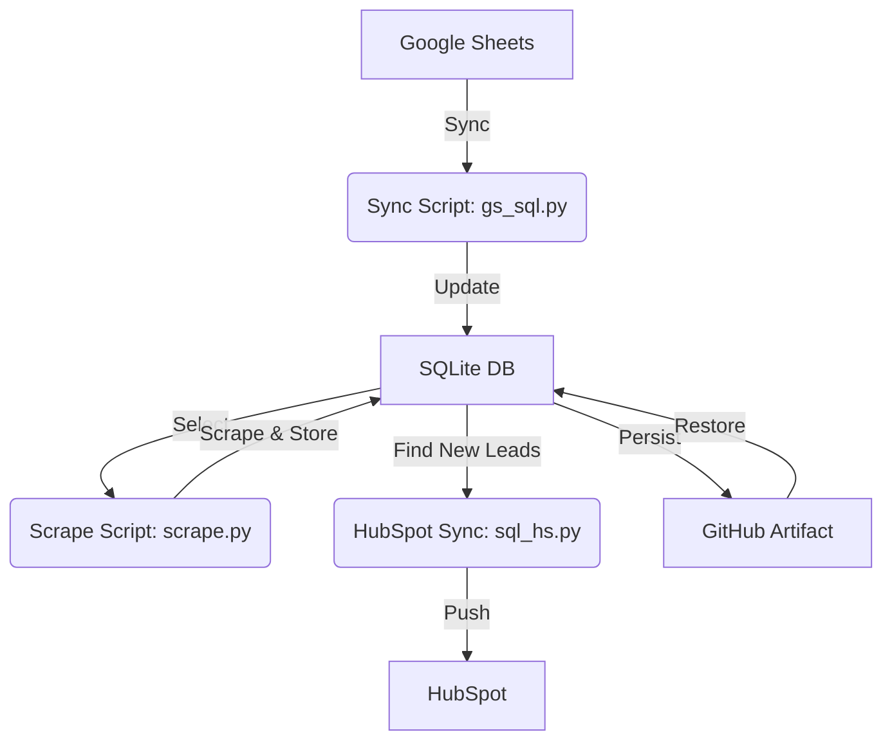

# Organic Social Pipeline v2 

**Automate, Integrate, and Scale LinkedIn Lead Generation**

---

## ✨ What is This?
A robust, fully-automated pipeline that:
- **Syncs LinkedIn post data from Google Sheets** (for accessibilty of non-technical users)
- **Scrapes post engagement data** using Apify, not your own LinkedIn account and cookies--no risk!
- **Stores and deduplicates everything in SQLite**
- **Pushes unique leads to HubSpot**
- **Runs itself daily via GitHub Actions**-—no manual intervention required!
- **Persists your database as a GitHub artifact** for reliable, stateful automation

---

## 🏗️ Architecture & Flow



- **Google Sheets**: Source of truth for LinkedIn post URLs/names
- **Python Scripts**: Modular, reliable, and easy to extend
- **SQLite**: Fast, portable, and versioned via GitHub Artifacts
- **HubSpot**: Receives only new, unique leads
- **GitHub Actions**: Schedules, runs, and persists everything

---

## 🛠️ Key Features
- **No Duplicates**: Deduplication at every step
- **Automatic Scheduling**: Runs daily, M–F, at a random time (UTC 9–17)
- **Stateful**: Database is uploaded/downloaded as an artifact—no data loss
- **Robust Logging**: All scripts log to timestamped files for easy debugging
- **Non-Technical Friendly**: Creative team updates a Google Sheet, pipeline does the rest
- **Easy to Extend**: Modular scripts for each stage

---

## 📝 SQL Schema
```sql
CREATE TABLE IF NOT EXISTS posts (
    post_url TEXT PRIMARY KEY,
    post_name TEXT,
    last_scraped_at TEXT,
    scrape_count INTEGER,
    total_reactions INTEGER
);

CREATE TABLE IF NOT EXISTS scrapes (
    scrape_id INTEGER PRIMARY KEY AUTOINCREMENT,
    post_url TEXT,
    ran_at TEXT,
    reactions_count INTEGER,
    cost REAL,
    status TEXT,
    FOREIGN KEY (post_url) REFERENCES posts(post_url)
);

CREATE TABLE engagers (
  engager_id INTEGER PRIMARY KEY AUTOINCREMENT,
  scrape_id INTEGER,
  linkedin_url TEXT,
  name TEXT,
  headline TEXT,
  engagement_type TEXT,
  pushed_to_hubspot BOOLEAN DEFAULT 0,
  FOREIGN KEY (scrape_id) REFERENCES scrapes (scrape_id)
)
```

---

## ⚡️ How It Works (Workflow)
1. **Restore DB**: Downloads the latest `post_scrapes.db` from GitHub Artifacts
2. **Google Sheets Sync**: `gs_sql.py` pulls new posts/names, deduplicates, and updates the DB
3. **Scrape**: `scrape.py` scrapes LinkedIn post engagement, stores results in DB
4. **HubSpot Sync**: `sql_hs.py` finds new leads and pushes them to HubSpot
5. **Persist DB**: Uploads the updated DB as an artifact for the next run
6. **Logging**: Each script writes detailed logs to `scripts/logs/`

---

## 🚀 Quickstart
1. **Clone the repo**
2. **Install dependencies**
   ```bash
   python -m venv venv
   source venv/bin/activate
   pip install -r requirements.txt
   ```
3. **Set up your `.env` and Google credentials**
   - See `scripts/encode_credentials.py` for encoding instructions
   - Add your Google Sheets, Apify, and HubSpot API keys
4. **Run locally (for testing)**
   ```bash
   cd scripts
   python gs_sql.py
   python scrape.py
   python sql_hs.py
   ```
5. **Automate with GitHub Actions**
   - Add your secrets (`SERVICE_ACCOUNT_KEY`, `APIFY_API_KEY`, `HUBSPOT_API_KEY`) in the repo settings
   - The workflow will run automatically and persist your DB

---

## 🧩 Scripts Overview
- **gs_sql.py**: Syncs Google Sheets → SQLite
- **scrape.py**: Scrapes LinkedIn post engagement → SQLite
- **sql_hs.py**: Pushes new leads from SQLite → HubSpot
- **utils.py**: Shared helpers for scraping, ingestion, and HubSpot API

---

## 🛡️ Reliability & Extensibility
- **Risk free LinkedIn Scraping**: Uses external accounts, cookies, and IPs
- **Database never lost**: Always restored/uploaded as an artifact
- **Logs for every run**: Debug and audit with ease
- **Easy to add new sources or destinations**: Just add a script and update the workflow

---

## 👩‍💻 For Non-Technical Users
- Just update the Google Sheet—no code, no problem!
- All syncing, scraping, and pushing is fully automated

---

## 📈 Why Use This Pipeline?
- **Save time**: No more manual copy-paste or lead uploads
- **Reduce errors**: Automation means fewer mistakes
- **Scale easily**: Add more posts, more scrapes, or more destinations
- **Audit everything**: Logs and database history are always available
---
