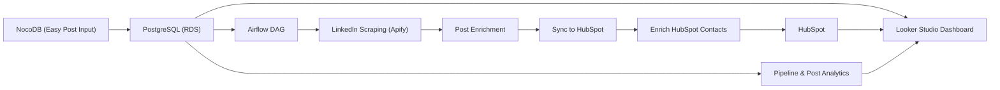
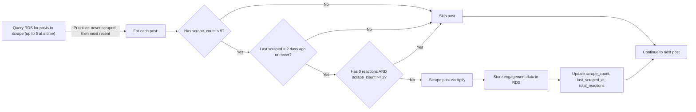

# LinkedIn Analytics Pipeline

## High-Level Overview

This project is an **automated LinkedIn scraping and enrichment pipeline** designed to power a Looker Studio dashboard and advanced reporting for marketing and creative teams. The pipeline orchestrates the collection, enrichment, and synchronization of LinkedIn post and engager data, making it accessible for both technical and non-technical users. It leverages a modern data stack, integrates with HubSpot for contact-level truth, and uses a relational database (RDS) for robust pipeline and post performance analytics.

---

## Tech Stack

- **Apache Airflow**: Orchestrates the end-to-end pipeline as a DAG.
- **Python**: All ETL and enrichment logic.
- **Docker**: Containerized for local and production parity.
- **PostgreSQL (RDS)**: Backend database for all pipeline and post analytics.
- **NocoDB**: No-code relational DB UI for easy post input and metadata management.
- **Apify**: Scraping engine for LinkedIn data.
- **HubSpot**: Source of truth for contact-level data and enrichment.
- **OpenAI**: Audience and position classification for engagers.
- **Looker Studio**: Dashboarding and reporting (via direct connection to RDS).
- **Pandas**: Data wrangling and transformation.
- **Requests**: API integrations (HubSpot, Apify, etc.).

---

## Database Schema & Reporting

- **Contact-level reporting** is done in HubSpot, which is the single source of truth for all contact and company data.
- **Pipeline and post performance reporting** is done via the RDS backend, which is the source of truth for all pipeline events and LinkedIn post analytics.

### Main Tables

- **linkedin_posts**: Stores all LinkedIn post metadata, enrichment, and custom fields (e.g., target_audience, post_type, sentiment).
- **linkedin_posts_scrapes**: Tracks every scrape event, including cost and timestamp.
- **linkedin_engagers_by_post**: Stores all engagers (people who interacted with posts), their engagement type, and enrichment status.

This dual-source approach allows for:
- **Contact-level truth in HubSpot** (for marketing/sales ops)
- **Pipeline and post analytics in RDS** (for Looker Studio and internal dashboards)

---

## NocoDB Integration

- **NocoDB** provides a no-code, spreadsheet-like interface for non-technical users (e.g., creative teams) to input new LinkedIn posts to scrape and to manage custom post-level fields such as:
  - `target_audience`
  - `post_type` (short form, long form, carousel, image, etc.)
  - `sentiment`
  - and more

This makes the pipeline highly accessible and flexible for rapid campaign iteration.

---

## Pipeline Workflow

The pipeline is orchestrated as an Airflow DAG with the following steps:

1. **Database Schema Setup**: Ensures all required tables and columns exist (idempotent).
2. **LinkedIn Scraping**: Scrapes posts and engagement data from LinkedIn using Apify.
3. **Post Enrichment**: Enriches posts with media details and custom fields.
4. **Sync to HubSpot**: Pushes new/updated contacts to HubSpot, ensuring contact-level truth.
5. **Enrich HubSpot Contacts**: Uses OpenAI and Apify to fill in missing company, title, and audience data for HubSpot contacts.

---

## High-Level Pipeline Overview

---

## Scraping Algorithm (Simplified)

**Key logic:**
- Only posts with `scrape_count < 5` are considered.
- Posts are skipped if they were scraped in the last 2 days.
- Posts with 0 reactions are skipped after being scraped twice.
- Prioritization: posts never scraped are scraped first, then by most recent.

---

## Setup & Usage

### Prerequisites

- Docker Desktop
- Astronomer CLI (for Airflow)
- Python 3.10+
- Access to Apify, HubSpot, and RDS credentials

### Local Development

1. Clone the repository
2. Install Astro CLI
3. Start Airflow locally:  
   `astro dev start`
4. Access Airflow UI at [http://localhost:8080](http://localhost:8080)

### Configuration

- All secrets and environment variables are managed via Airflow Variables/Connections or a `.env` file for local testing.
- NocoDB should be connected to your RDS instance for post input.

---

## Contributing

- Fork the repo and create a feature branch
- Add/modify scripts in `include/` and update the DAG as needed
- Test locally with Astro
- Open a pull request with a clear description

---

## Contact

For questions or onboarding help, contact the project maintainer or open an issue.
